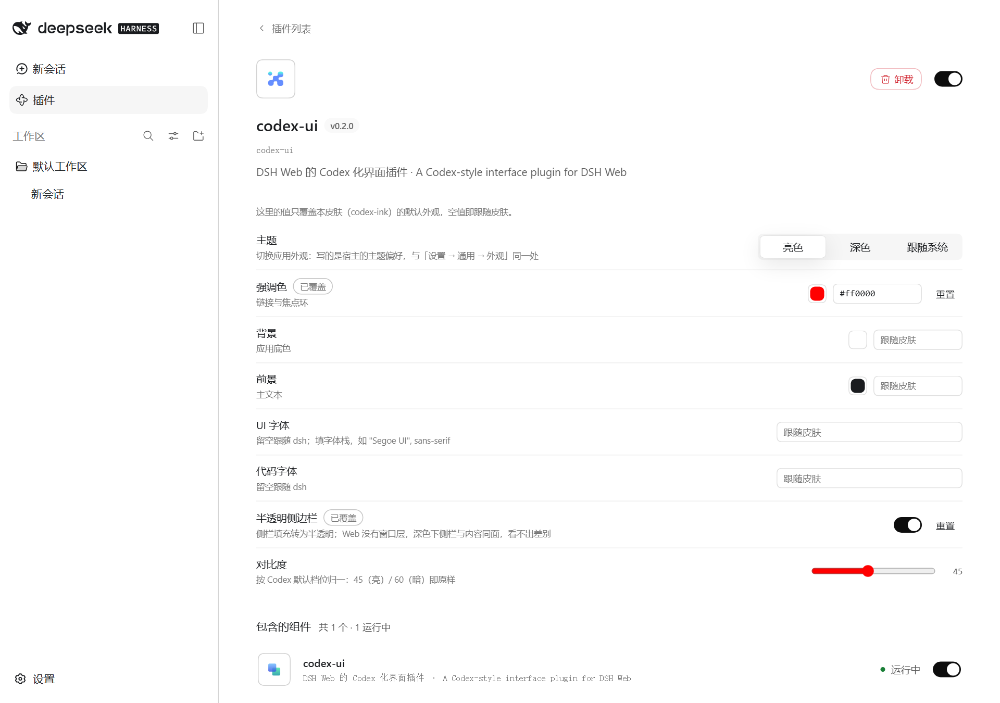
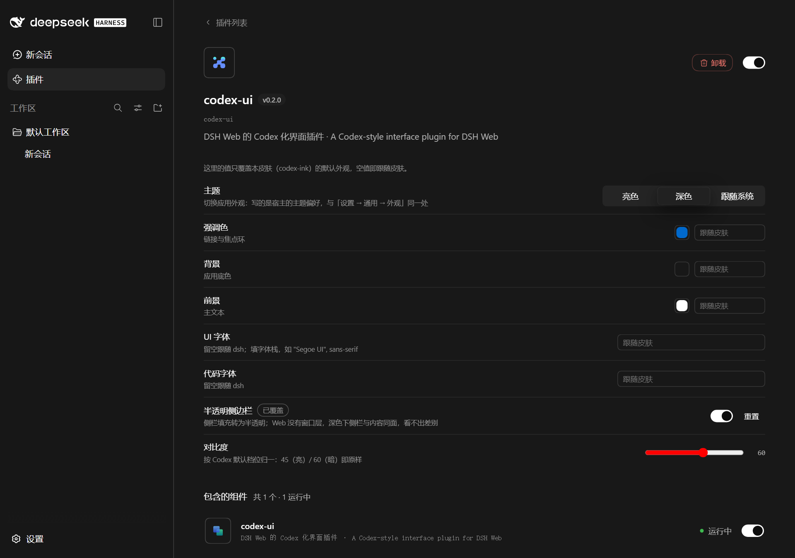

<p align="center">
  
</p>

<div align="center">

  # codex-ui

  **让 DSH Web 呈现 Codex 的外观：窗口边缘、侧栏分界、模型菜单、输入区、主题色**

  [English](README.md) · [更新日志](CHANGELOG.zh-CN.md) · [MIT](LICENSE)

  [](LICENSE)
  [](https://github.com/deepseek-ai/deepseek-harness)
  [](https://nodejs.org/)
  [](https://github.com/rinDBeans/codex-ui/actions/workflows/ci.yml)

</div>

> codex-ui 是社区维护的 DeepSeek Harness（DSH）界面插件，并非 DeepSeek AI 官方产品。

DSH Web 的界面元素按 Codex 复刻：窗口边缘的阴影与发丝线、侧栏分界线、模型与推理等级菜单、输入区结构、浅色与深色主题色。取值来自 Codex 实机截图与取色面板，逐像素测量，测量过程写在 README 的「实测值」一节，参考图存在 `assets/reference/`。

## 宿主兼容性

本工作区对照 DSH `0.1.7-rc.1`（npm 全局安装）与 `0.1.7-rc.2`（Windows 桌面壳的 `app.asar`）开发。
夹具脚本直接读 `app.asar` 里的 shipped CSS，宿主升级后若结构变化，夹具断言会失败。

## 功能

| 编号 | 内容 |
|---|---|
| ⑫ | 模型选择器：原生触发器、不透明白菜单、行高 28px、勾选列常驻、pending 转圈 |
| ⑬ | 输入区顶栏消隐、面板按钮保留官方图标 |
| ⑭ | 输入卡：圆角、阴影、几何、工具条、hero 布局 |
| ⑯ | 右栏展开选择组件：无描边无底色、行高 52px、图标 20px、快捷键灰底 pill |
| ⑰ | composer 底部控件：加号默认无底色框、悬停才填；模型与权限控件同套悬停胶囊 |
| ② | 侧栏配色对齐 Codex 亮色侧栏；侧栏列对齐工作区列表行 |
| ②c | 会话窗口边缘：0.5px 发丝线加 24px 全向环境影 |
| ②d | 右栏面板：左沿只留发丝线、影只往上泄；压掉 dockkit 的 1px 深边框 |
| ②e | 右分界线拖拽柄：悬停时中段最深、两端淡出的渐变 |
| ⑱ | 插件管理 → codex-ui 组合包页的设置卡：主题 / 强调色 / 背景 / 前景 / UI 字体 / 代码字体 / 半透明侧边栏 / 对比度 |

## 界面

浅色：会话窗口边缘与右栏。


输入区底栏：默认无框，悬停出胶囊。


模型菜单的 pending 状态。


## 安装

```powershell
npm run install:web        # node scripts/install-plugin.mjs --write
npm run install:desktop    # 桌面壳，改完重启应用
npm run build              # 由 skins/codex-ink 重新生成 theme.css 与 client.js

node scripts/install-plugin.mjs                              # 只读体检（默认 web profile）
node scripts/install-plugin.mjs --bundle --write              # 注册方式改成 dsh.profile.bundles，并清掉冗余 insert
node scripts/build.mjs --check                               # 只比对产物是否过期，不落盘
```

安装动作：把 `skins/codex-ink/` 的六份 CSS 作用域化到 `html[data-codex-ui]`，写出 `theme.css`，与 `src/client.template.js`
（内嵌 `src/override.js` 与 `src/settings-card.js`）合成 `client.js`，同步到 `profiles/<name>/vendor/codex-ui`，
建 `node_modules/codex-ui` junction，并确保注册方式只有一种。作用域化与拼装只有一份实现，在 `src/build.mjs`。

注册方式二选一，**绝不能同时用**（同时存在会出现两个同名 loader 条目，市场校验判 fail 并把插件停用）：

| 方式 | 写法 | 用在 |
|---|---|---|
| bundle | 包名进 profile `package.json` 的 `dsh.profile.bundles`，由包自带 `cordis.patch.yml` 完成 insert | 桌面壳 profile、web profile（`--bundle`） |
| insert | 在 profile 的 `cordis.patch.yml` 手写 `- insert:` | 免 pnpm install 的临时验证 |

同一份样式正本也可由皮肤加载器收录：

```powershell
node scripts/install-skin.mjs          # 与 $DSH_HOME/skins/codex-ink 逐文件 SHA256 比对
node scripts/install-skin.mjs --write  # 有漂移则覆盖
```

## 目录

| 路径 | 内容 |
|---|---|
| `index.js` `cordis.patch.yml` `package.json` | 插件宿主半与清单 |
| `src/client.template.js` | 浏览器半模板（注入样式、覆盖层与设置卡座位） |
| `src/override.js` | 设置页覆盖层纯函数（无 DOM，夹具直接单测） |
| `src/settings-card.js` | 组合包页那张配置卡（构建期拼进 `client.js`） |
| `src/build.mjs` | 作用域化与产物生成，唯一实现 |
| `theme.css` `client.js` | 生成物，由 `src/build.mjs` 从 `skins/codex-ink/` 写出 |
| `skins/codex-ink/` | 样式正本（skin.css / patches.css / sidebar-align.css / window-shadow.css / composer.css / settings.css） |
| `docs/` | 计划与决策留档 |
| `scripts/build.mjs` | 重新生成产物；`--check` 只比对不落盘 |
| `scripts/check-repo.mjs` | 不依赖宿主的仓库体检，CI 入口 |
| `scripts/host-paths.mjs` | 解析 `app.asar`、全局 `@deepseek-ai` 包与 Chromium |
| `scripts/install-plugin.mjs` `scripts/install-skin.mjs` | 安装器 |
| `scripts/*-verify.mjs` `scripts/live-gui-probe.mjs` `scripts/settings-page-verify.mjs` | 夹具验收与真 GUI 探针 |
| `scripts/make-verify-profile.mjs` | 造一次性验证 profile：插件管理页开着、只挂本插件、不碰现有 profile |
| `assets/reference/` | Codex 实机参考图 |
| `assets/screenshots/` | 验收出图 |
| `.github/workflows/ci.yml` | CI |

## 验收

| 命令 | 覆盖 | 前置 |
|---|---|---|
| `npm run check` | 语法、JSON、清单自洽、产物同源、编码、双语文档成对、机器专属路径 | 无 |
| `node scripts/audit-codex-ink.mjs` | 皮肤结构、36 组 WCAG、彩色白名单 | 无 |
| `node scripts/model-picker-verify.mjs` | ⑫ 与 pending 指示器，18 项 | 无 |
| `node scripts/rightbar-verify.mjs` | 阴影层、右栏三件套、两条分界线，42 项 | 无 |
| `node scripts/sidebar-align-verify.mjs` | 侧栏列对齐，6 项 | 无 |
| `node scripts/hero-verify.mjs` | ⑬⑭⑰ 与焦点环，8 项 | 无 |
| `node scripts/live-gui-probe.mjs --url <带 token 的 URL>` | 真 GUI：阴影、两条分界线、模型菜单 pending 窗口共 10 项断言 | `dsh web` 实例 |
| `node scripts/settings-page-verify.mjs --url <带 token 的 URL>` | 真 GUI：组合包页的设置卡、8 行结构、默认不覆盖、开关与强调色写入、刷新后仍在，共 20 项断言 | `dsh web` 实例（profile 需启用插件管理） |

`npm run check` 不需要宿主。五支夹具验证在本机跑：取 `app.asar` 的 shipped CSS 加按渲染代码复刻的 DOM，
用 `getComputedStyle` 读值。夹具没有标题栏条、真实 AppFrame 网格与真 RPC，阴影层、分界线悬停与 pending
反馈由真 GUI 探针取证。

### 宿主路径

验收脚本读的是它跑在其中的宿主，三个路径按同一优先级解析：

1. 环境变量 `DSH_ASAR`、`DSH_GLOBAL_MODULES`、`DSH_CHROME`；
2. `scripts/host.local.json`（本机配置，已 gitignore），例：`{ "asar": "D:/.../resources/app.asar" }`；
3. 扫描常见安装位置、Playwright 的浏览器缓存与 `npm root -g`。

仓库里不含任何一台机器的绝对路径。

真 GUI 探针用法：

```powershell
dsh --profile web --port 3099 --no-open      # 终端打印带 token 的 URL
node scripts/live-gui-probe.mjs --url "http://127.0.0.1:3099/?token=..." --dpr 1.5
```

探针在量 pending 窗口前自己先开一个新会话，断言不过时退出码非 0。token 有存活期，约半小时后返回 401，重起一次取新 token。

## 设置页

官方插件管理的组合包页上那张配置卡（座位 `plugins.bundle.config`，键为**包名** `codex-ui`）。
桌面应用里：侧栏「插件」→「已安装」→ `codex-ui` → 页面上的配置卡；改完即时生效，不需要重启。



深色下同一张卡（主题切到深色后，下面三行自动改为编辑深色那一套，对比度显示深色默认档 60）：



| 面板行 | Config 字段 | 默认 | 落点 |
|---|---|---|---|
| 主题 | —（写宿主 `ui-theme` 的 `preference`） | 跟随系统 | `ctx.theme.setTheme()`：整个应用一起切，与「设置 → 通用 → 外观」同一处 |
| 强调色 | `accentLight` / `accentDark` | 空 = 跟随皮肤 | `--dsw-alias-link`、`--dsw-codex-focus` |
| 背景 | `surfaceLight` / `surfaceDark` | 空 | `--dsw-alias-bg-base` |
| 前景 | `inkLight` / `inkDark` | 空 | `--dsw-alias-label-primary` |
| UI 字体 | `fontUi` | 空 | `--dsw-font-family` |
| 代码字体 | `fontCode` | 空 | `--ds-font-family-code` |
| 半透明侧边栏 | `translucentSidebar` | 关 | 侧栏填充与行填充转半透明 |
| 对比度 | `contrastLight` / `contrastDark` | 45 / 60 | 文本档位与中性 alpha 阶梯 |

- **主题那一行不是卡片自己的界面状态**：它走宿主 `theme` 服务的唯一写入口（`ctx.theme.setTheme(id)`，
  `id ∈ light/dark/system`），写的是 `ui-theme` 的 `preference`，与「设置 → 通用 → 外观」是同一处 ——
  切完整应用一起变，刷新后还在。下面三行颜色编辑的是**当前生效的那一套**（`active.colorScheme`）。
- 11 个字段全部 `.volatile()`：设置服务只投影标了它的字段，插件管理页也正是靠这一点认得这个条目 ——
  没有 `Config` 就没有这张卡。
- **空值 = 不覆盖**：默认值下覆盖层输出空串、`data-codex-ui-theme` 属性不出现，所以装上不动一个字时，
  外观与 0.1.x 逐字节相同（这一条是夹具断言）。
- 覆盖只写在运行时的一条 `<style>` 里，选择器比皮肤多一个属性（特异性 +1），因此不依赖样式表先后顺序，
  `skins/*.css` 一个字不动。
- 改一下即写、没有保存按钮；文本框回车或失焦提交，写后回读确认落地；已覆盖的行显示徽标与「重置」。
- 对比度是**简化实现**：应用用线性 RGB 混合把文本往 ink 拉、并按常量抬升灰阶；这里只做同一方向的两件事 ——
  文本档位按比例混合、发丝线与中性色调家族按比例缩放（夹在 0.5×–2× 之间）。彩色状态色与 diff 底色不参与，
  免得把调色板搬进覆盖层。
- 半透明侧边栏在 Web 上没有窗口层，只能透出页面底色；深色下侧栏与内容同面，开了看不出差别 ——
  所以开关同时把侧栏行填充转半透明，否则整个开关在深色下完全无声。这是如实记录的差距，不是等价实现。

## 实测值

### 窗口边缘

`assets/reference/codex-app-reference-1x.png`（1901x1107，DPR 1）：

| 位置 | 切法 | 值 |
|---|---|---|
| 会话窗口左沿 | y=600 | x=340..355 由 238,241,247 渐变到 231,233,239，x=356 单像素 212,215,221 |
| 会话窗口上沿 | x=800 | y=30..45 由 237,242,247 渐变到 232,237,242，y=46 单像素 214,218,224 |
| 右栏面板左沿 | y=600 | x=1437 单像素 237,237,237，两侧纯白 |
| 右栏面板上沿 | x=1700 | y=46 单像素 213,218,224，上方同套渐变 |

发丝线在两份参考图里都是 1 个设备像素，因此写 0.5 CSS px：本机缩放 150%，1px 会栅格化成 2 个设备像素。

| 对象 | box-shadow |
|---|---|
| 会话窗口 | `0 0 0 0.5px var(--dsw-alias-border-l2), 0 0 24px rgba(13,13,13,.05)` |
| 右栏面板 | `0 0 0 0.5px var(--dsw-alias-border-l1), 0 -12px 24px -12px rgba(13,13,13,.05)` |

### 主题色

来源 `assets/reference/codex-theme-light.png`、`codex-theme-dark.png`（Codex 取色面板）。

| 角色 | 浅色 | 深色 | 令牌 |
|---|---|---|---|
| 强调色 | `#339CFF` | `#0169CC` | `--dsw-alias-link` |
| 背景 | `#FFFFFF` | `#181818` | `--dsw-alias-bg-base` |
| 前景 | `#1A1C1F` | `#FFFFFF` | `--dsw-alias-label-primary` |
| 悬停底 | `#F2F2F3` | `rgba(255,255,255,.08)` | `--dsw-codex-hover-fill` |

浅色三值来自取色面板 `codex-theme-light.png`；**深色三值自 0.2.0 起改用 Codex 应用自身的默认值**
（`resources/app.asar` 里的 `jdi`：`surface #181818`、`ink #ffffff`、`accent #339cff`），不再用取色面板那三值。
深色链接仍是应用的 text-link 令牌 `#0169CC`，没有跟着 accent 走。

深色层级自 `#181818` 向上抬：侧栏 `#181818`（与 surface 同面，分隔交给 0.5px 发丝线）、层1 `#212121`、
层2 `#282828`、层3 `#303030`；alpha 家族随之由 `rgba(252,252,252,·)` 抬到 `rgba(255,255,255,·)`
（应用的深色 `--alpha-base` 是 `#fff`）。

### 侧栏配色

来源 `assets/reference/codex-sidebar-reference.png` 点采样。

| 令牌 | 值 |
|---|---|
| `--dsw-alias-bg-sidebar` | `#eef4f9` |
| `--dsw-specific-sidebar-fill` | `#eef4f9` |
| `--dsw-specific-sidebar-nav-item-active` | `#e2e9ed` |
| `--dsw-specific-sidebar-nav-item-hover` | `#e8eef3` |

## 边界

- 夹具验证不是登录态截屏。`dsh web` 的 launch token 有存活期且只在进程内。
- headless 单窗口只有前台页签处理 `:hover`，多页夹具把 web 形态页最后打开。
- 模型与强度同屏扁平单列表、行内每模型描述列需要客户端插件占用 `conversation.input.model` 槽并复用 `ctx.modelDirectories`，本层未做。
- ⑯ 保留宿主页签条：整条隐藏会连带去掉全屏与收起按钮。
- 会话行文字列 40px，比工作区行、新会话、插件行短 2px，来自官方 `Rows.module.css` 的 `.sessionRow .title` margin，未改。
- `composer.css` 与 `patches.css` 使用 21 处哈希类名后缀锚点（`[class$=…]`、`[class*=…]`），宿主没有对应 `data-*` 的位置只能如此。

## 与 Codex 源码对账

Codex 桌面应用的 webview CSS 在 `resources/app.asar` 的 `webview/assets/app-*.css` 里；公开的 `openai/codex`
仓库是 CLI 与 TUI，不含这套界面。下表取值来自应用 `26.727.4816.0`。

| 值 | Codex | 本皮肤 |
|---|---|---|
| 动效时长 | `--transition-duration-basic: .15s`、`--transition-duration-relaxed: .3s` | `--dsw-motion-fast: 150ms`、`--dsw-motion-slow: 300ms` |
| 缓动 | `--ease-in-out` 与 `--default-transition-timing-function`，同为 `cubic-bezier(.4, 0, .2, 1)` | `--dsw-ease` |
| 焦点环 | `--color-border-focus` = `--blue-300` `#339cff`；深色同色 70% | `--dsw-codex-focus` |
| pending 转圈 | `--animate-spin: spin 1s linear infinite` | `codex-ui-spin 1s linear infinite` |
| 发丝线 | `--shadow-hairline: 0 0 0 .5px #0000001a` | 会话窗口与面板发丝线同为 0.5px 环 |
| 亮色前景 | `--color-text-foreground: #1a1c1f` | `--dsw-alias-label-primary` |
| 控件填充 | `--background-button-secondary-hover`，前景色 8% | 浅色 `#f2f2f3`（实测），深色 `rgba(255,255,255,.08)` |

刻意保留的差异：

- 深色基面自 0.2.0 起对齐应用默认值：`jdi.dark.surface = #181818`、`jdi.dark.ink = #ffffff`，层级抬到
  `#212121 / #282828 / #303030`（应用灰阶的 gray-800 / gray-750 / gray-700）。0.1.x 用的取色面板三值
  `#111111 / #FCFCFC` 已不再使用。应用完整灰阶是
  `#0d0d0d / #181818 / #212121 / #282828 / #303030 / #414141 / #4f4f4f / #5d5d5d / #afafaf / #ededed / #f3f3f3 / #f9f9f9 / #fff`。
- 对比度滑块是简化实现（见「设置页」一节），没有复刻应用的 `Rdi + zdi·contrast` 线性混合常量。
- 输入卡圆角 25px 是 `assets/reference/codex-composer-reference.png` 上的实测值。应用 CSS 给多行输入卡 `--radius-3xl`（20px）、
  单行 22px；差额来自截图缩放比，而该比例没有记录。
- 侧栏 280px 由宿主布局决定。Codex 自己的侧栏是 `clamp(240px, 275px, min(520px, calc(100vw - 320px)))`。
- 深色链接保留 `#0169cc`，即应用 `--color-token-text-link-foreground` 的取值；想要 `#339CFF` 现在可以直接在设置页拖强调色。
  应用自身的 `--color-text-accent` 在深色下是 `#99ceff`（`--blue-100`）。

## CI

`.github/workflows/ci.yml` 在 Ubuntu 与 Windows、Node 22 与 24 上跑 `scripts/check-repo.mjs` 与
`scripts/build.mjs --check`。夹具验收与真 GUI 探针要桌面壳与 Chromium，留在本机跑。

## 许可

MIT。